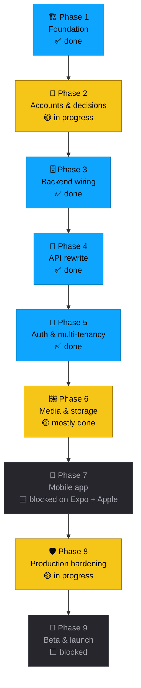

# 🗺️ Roadmap

> [!NOTE]
> This roadmap is **untimed**. Phases unlock when their dependencies are met, not on a calendar. Every shipped item gets a ✅ the moment it lands on the `production` branch.

## Progress

```
Phase 1 ████████████████████  100%
Phase 2 ████████░░░░░░░░░░░░   38%   (your accounts/decisions — Apple enrollment is in flight)
Phase 3 ████████████████████  100%
Phase 4 ████████████████████  100%
Phase 5 ████████████████████  100%
Phase 6 ████████████████░░░░   80%   (signed-URL upload + read shipped in Phase 4)
Phase 7 ░░░░░░░░░░░░░░░░░░░░    0%   ← next (blocked on Expo account + Apple/Google enrollment)
Phase 8 ████████████░░░░░░░░   60%   (headers, logger stub, error boundary, comprehensive CI shipped)
Phase 9 ░░░░░░░░░░░░░░░░░░░░    0%

Bonus polish (post-Phase 5, pre-mobile): templates, signup onboarding picker, FAQ, changelog, account section, magic-link, OAuth UI
```

## How the phases connect



> Legend: 🟦 done · 🟨 in progress · ⬛ blocked on a dependency

---

## 🏗️ Phase 1 — Foundation ✅

The local prototype gets the structure it needs to grow into a real product. No external accounts required.

**Status:** ✅ complete · merged on `production`

<details>
<summary><strong>What shipped</strong> (22 items)</summary>

### Repo structure
- [x] Monorepo restructured to `apps/web` + `packages/shared` + `packages/api`
- [x] Existing data preserved through the move
- [x] npm workspaces wired up (no pnpm required)
- [x] Local dev still works: `npm run dev` from the root serves the existing app

### Backend artifacts (staged, not yet applied)
- [x] Postgres schema migration written
- [x] Row-level security policies written
- [x] Sign-up seed trigger written (auto-creates default 12 tasks + challenge + settings per new user)
- [x] Storage bucket policies written

### CI + quality
- [x] GitHub Actions workflow: lint + test + build on every PR
- [x] Vitest configured in `packages/shared`
- [x] 25 unit tests for date math and task helpers — all passing
- [x] Production build (`npm run build`) verified green, including type-check + lint
- [x] Three LucideIcon prop-type bugs fixed (would have failed CI)

### Production hardening (no accounts needed)
- [x] Security headers on every response (X-Frame-Options, X-Content-Type-Options, Referrer-Policy, Permissions-Policy; HSTS in prod)
- [x] `/api/health` endpoint for uptime monitoring
- [x] Custom `not-found.tsx` (friendly 404)
- [x] Global `error.tsx` boundary (retry + request ID)
- [x] `lib/logger.ts` — newline-JSON logger ready to swap for Sentry

### Drafts
- [x] Privacy Policy template (GDPR/CCPA aware) at `plan/legal/`
- [x] Terms of Service template at `plan/legal/`
- [x] App Store Connect metadata at `plan/store-listings/`
- [x] Play Console metadata + Data Safety form at `plan/store-listings/`
- [x] Screenshots plan with story arc + device sizes
</details>

---

## 🔑 Phase 2 — Accounts & decisions 🟡

The only phase that requires *only* you. Most of these can run in parallel; the slow ones (Apple, Google) gate later phases, so start them first.

**Status:** 🟡 in progress (8 of 21 done)

> [!IMPORTANT]
> **Apple Developer enrollment takes 24-72 h to activate.** Start it first; everything else can fill in around it. Phase 3 unlocks the moment Supabase has a staging project.

### 🤖 What I already shipped here

- [x] Brand naming + nav badge updated to **Program**
- [x] Domain placeholder used consistently in legal + store drafts
- [x] Plan docs: 00-overview, 01-architecture, 02-backend, 03-mobile, 04-sync, 05-deployment, 06-distribution, 07-production-readiness, 08-roadmap
- [x] Push the `production` branch to GitHub

### 👤 What only you can do

| Status | Item | Cost | Notes |
| ------ | ---- | ---- | ----- |
| ⬜ | [Apple Developer Program](https://developer.apple.com/programs/enroll/) | $99/yr | 24–72 h to activate. **Start first.** |
| ⬜ | [Google Play Console](https://play.google.com/console) | $25 one-time | ~48 h to activate. |
| ⬜ | [Supabase](https://supabase.com) account + `program-staging` project | Free | **Unlocks Phase 3.** |
| ⬜ | [Vercel](https://vercel.com) account (link GitHub) | Free | |
| ⬜ | [Sentry](https://sentry.io) account | Free | |
| ⬜ | [Expo](https://expo.dev) account | Free | Needed for Phase 7. |
| ⬜ | Buy a domain | ~$12/yr | Locks the brand. |
| ⬜ | Reserve App Store + Play bundle / package IDs | Free | e.g. `com.yourname.program` |

### 🧭 Decisions (no signup needed, just thought)

| Status | Decision | Default if no answer |
| ------ | -------- | -------------------- |
| ⬜ | Final brand name | `Program` |
| ⬜ | Free or paid v1 | Free |
| ⬜ | US-only or worldwide | Worldwide (GDPR-aware) |
| ⬜ | Anonymous accounts allowed | No (force sign-in) |

---

## 🗄️ Phase 3 — Backend wiring ✅

Take the staged SQL from Phase 1 and apply it to a real Postgres database.

**Status:** ✅ done

### What shipped

- [x] Supabase CLI installed and linked to staging
- [x] Applied `20260528000000_initial_schema.sql`
- [x] Applied `20260528000001_rls_policies.sql`
- [x] Applied `20260528000002_seed_defaults_trigger.sql`
- [x] Created `progress-photos` storage bucket (private)
- [x] Applied `20260528000003_storage_bucket.sql` (fixed: removed unsupported `IF NOT EXISTS` on `CREATE POLICY`)
- [x] Smoke test: `smoketest@example.com` user has 12 tasks + 1 challenge + 1 user_settings row, confirming the seed trigger fired
- [x] Supabase environment variables in `apps/web/.env.local`; template at `apps/web/.env.example` updated to current naming
- [x] Verification script at `apps/web/scripts/verify-supabase.mjs` — runnable any time with `node apps/web/scripts/verify-supabase.mjs`

---

## 🔌 Phase 4 — API rewrite ✅

Replace the in-process `better-sqlite3` calls with Supabase calls behind a tRPC API that the mobile app can also consume.

**Status:** ✅ done · verified end-to-end against staging Supabase

### What shipped

- [x] tRPC infrastructure in `packages/api/` (context, middleware, root router)
- [x] Auth middleware reads session cookie (web)
- [x] Routers: `tasks`, `entries`, `media`, `stats`, `settings`, `challenges`
- [x] Every existing Server Action ported to a tRPC procedure with the same input/output shape
- [x] `apps/web/src/lib/db.ts` rewritten on top of the Supabase client (`better-sqlite3` retired on `production`)
- [x] TanStack Query wired into the web client via `<TrpcProvider>`
- [x] Optimistic updates preserved on all mutations
- [x] Existing UI behavior unchanged from the user's perspective
- [x] Photo upload + read flow rewritten on Supabase Storage signed URLs (Phase 6 work done early)

**Definition of done:** the web app at staging looks and feels identical to the local-only version, but writes land in Postgres. ✅

---

## 🔐 Phase 5 — Auth & multi-tenancy ✅

Real sign-up, real sign-in, account management, and a path off the local prototype.

**Status:** ✅ done (OAuth provider config in Supabase remains a Phase 2 you-task)

### What shipped

- [x] Email + password sign-up and sign-in
- [x] Magic-link sign-in (web)
- [x] Forgot-password + reset-password flow with branded email
- [x] Google OAuth UI button (provider config in Supabase pending — Phase 2)
- [x] Apple OAuth UI button (provider config + Apple Developer enrollment pending — Phase 2)
- [x] Account menu in the nav: email, sign out, account settings, danger zone
- [x] **Change email** (re-confirmation email) + **change password** (current-password verified)
- [x] **Delete my account** flow with type-to-confirm + cascade across all user data
- [x] **Download my data** flow (JSON export of tasks, completions, weights, notes, journals, photos)
- [x] `tools/import-from-sqlite.mjs` script — read old local SQLite DB and seed into Supabase by user
- [x] Branded HTML email templates in `apps/web/supabase/email-templates/`

---

## ✨ Bonus polish (post-Phase 5, pre-mobile) ✅

Work that wasn't on the original phase list but shipped on `production` while waiting on user-side accounts:

- [x] **Program templates** — 6 starter presets in `packages/shared/src/templates.ts` (100 Hard, 75 Hard, 75 Soft, Movement Streak, Reset Week, Custom). Pick one from Settings to archive current tasks and replace.
- [x] **Signup onboarding picker** — `/onboarding` page shown after email confirmation, picks one template (or skip) before landing on Today.
- [x] **Comprehensive CI** — 7-job GitHub Actions pipeline (lint, typecheck × 3 workspaces, tests, migrations sanity, audit, build + bundle-size check, summary). Audit runs `continue-on-error` to surface the 14 Next 14 advisories without blocking.
- [x] **41 unit tests** across templates, icons, dates, tasks. All passing.
- [x] **CI status badge** in README.md
- [x] **/help (FAQ) + /changelog** public pages
- [x] **Mobile app placeholder** route + footer link
- [x] **SEO surface** — `robots.txt`, `sitemap.xml`, `/opengraph-image`, real `<title>`/`<meta>` per route
- [x] **CLAUDE.md** orientation file checked in so future AI sessions ramp fast

---

## 🖼️ Phase 6 — Media & storage 🟡

Move progress photos from the laptop filesystem to Supabase Storage so they sync across devices.

**Status:** 🟡 mostly shipped during Phase 4 — only the host-allowlist remains

### What shipped

- [x] `progress-photos` storage bucket created (private, RLS-scoped per user)
- [x] Photo upload routes via signed PUT URL through `uploadProgressPhotoAction`
- [x] Photo preview reads via signed GET URL through `getPhotoUrlAction`
- [x] Old local `public/progress-photos/*` files migrated by `tools/import-from-sqlite.mjs`

### Remaining

- [ ] `next.config.mjs` `images.remotePatterns` updated to allow the Supabase storage host (currently photos render via ``, not `next/image`)

---

## 📱 Phase 7 — Mobile app ⬜

The iOS + Android client. Same data, native screens.

**Status:** ⬜ blocked on Phase 6

> [!IMPORTANT]
> This phase needs the Apple Developer + Google Play accounts and the Expo account from Phase 2. Mobile bundle IDs must be reserved before this phase begins.

### What ships in this phase

- [ ] `apps/mobile` Expo project in the monorepo
- [ ] NativeWind configured against the shared Tailwind tokens
- [ ] React Navigation tab bar (Today / Calendar / Stats / Settings)
- [ ] Sign-in + sign-up + magic-link screens
- [ ] tRPC client + TanStack Query against staging
- [ ] Deep links for magic-link sign-in
- [ ] TodayScreen with native cards + reanimated task-check
- [ ] CalendarScreen with native bottom sheet for day detail
- [ ] StatsScreen with native charts
- [ ] SettingsScreen with native editor + bottom-sheet icon picker
- [ ] Photo card uses `expo-image-picker` + signed-URL upload
- [ ] Welcome modal / onboarding stack
- [ ] Restart banner + completion screen
- [ ] App boots on iOS simulator + Android emulator

---

## 🛡️ Phase 8 — Production hardening 🟡

Ship-quality monitoring, security, and policy compliance.

**Status:** 🟡 in progress — foundations shipped; deploy-target work waits on Phase 2 (Vercel/Sentry accounts)

### What shipped

- [x] Security headers on every response (X-Frame-Options, X-Content-Type-Options, Referrer-Policy, Permissions-Policy)
- [x] HSTS configured for production
- [x] `lib/logger.ts` newline-JSON structured logger (Sentry-swappable stub)
- [x] Global `error.tsx` boundary with request ID
- [x] Friendly `not-found.tsx`
- [x] Privacy Policy published at `/privacy` (drafts — needs lawyer review before launch)
- [x] Terms of Service published at `/terms` (drafts — needs lawyer review before launch)
- [x] Comprehensive CI on every push: lint + typecheck × 3 workspaces + tests + migrations sanity + audit + build with bundle-size check
- [x] `npm audit` job (currently surfaces 14 Next 14 advisories as known/non-blocking; revisit during Next 15 upgrade for deploy)

### Remaining

- [ ] Sentry web project integrated (needs Sentry account from Phase 2)
- [ ] Sentry mobile project integrated (Phase 7)
- [ ] PostHog opt-in analytics (optional)
- [ ] Rate limiting on write endpoints (Upstash Redis middleware)
- [ ] CSP header configured with the real third-party origin allowlist
- [ ] Restore drill performed against staging
- [ ] Status page set up (Hyperping / BetterUptime / manual)
- [ ] One-page incident runbook written
- [ ] Next 14 → 15 upgrade to clear the 14 high-severity advisories before public deploy

---

## 🚀 Phase 9 — Beta & launch ⬜

TestFlight + Play internal track → store submission → public release.

**Status:** ⬜ blocked on Phase 8

### Beta sub-phase

- [ ] First EAS Build for iOS uploaded to TestFlight
- [ ] First EAS Build for Android uploaded to Play internal track
- [ ] 5-10 testers invited
- [ ] In-app feedback path (`mailto:`)
- [ ] Bug reports triaged daily
- [ ] **Exit criteria:** 5 testers using the app 10+ days with zero P0 bug reports

### Store submission sub-phase

- [ ] Final EAS production builds
- [ ] App Store Connect metadata completed (from `plan/store-listings/app-store.md`)
- [ ] Play Console metadata + Data Safety form completed (from `play-store.md`)
- [ ] Screenshots captured per `screenshots.md`
- [ ] Demo account created and seeded for App Review
- [ ] Submitted for review

### Launch sub-phase

- [ ] iOS approval received
- [ ] Android approval received
- [ ] Phased rollout enabled (10% → 50% → 100% over 5 days)
- [ ] Custom domain DNS verified
- [ ] Sentry watched for 72 h with no surprises
- [ ] **Public** 🎉

---

## 🔭 Post-launch backlog (no order)

Not part of v1. These ride on signals from real users.

- Push notifications (morning kickoff + evening "tasks left" reminders)
- Supabase Realtime for sub-second cross-device updates
- Couples / accountability mode (share a program with one other user)
- Apple HealthKit + Google Fit auto-import (weight, workout)
- Light mode
- iOS home screen widgets + Android lock-screen widgets
- Apple Watch glance
- Offline-first sync (replaces the cache-only strategy from `04-sync-strategy.md`)
- Web landing page that actually converts
- Paid tier (if data warrants)

---

## How this file gets updated

Every time something ships, I add `[x]` and re-bake the progress bar at the top. If a phase moves from blocked to in-progress, its status badge flips from ⬜ to 🟡. When all of a phase's items are checked, its badge flips to ✅ and the next phase's status flips to 🟡.

To see at a glance what's left in flight, search for `🟡` in this file — that's the live phase.

> [!TIP]
> The companion to this file is [`USER-TODO.md`](./USER-TODO.md), which lists exactly what **you** need to do, in dependency order, with checkpoints I can act on the moment they're done.
